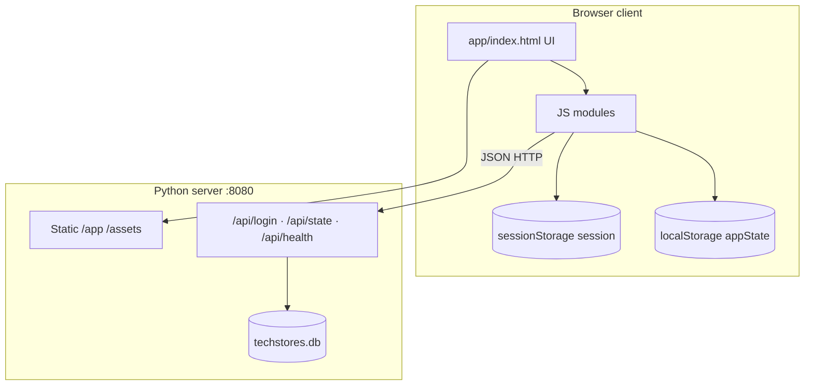
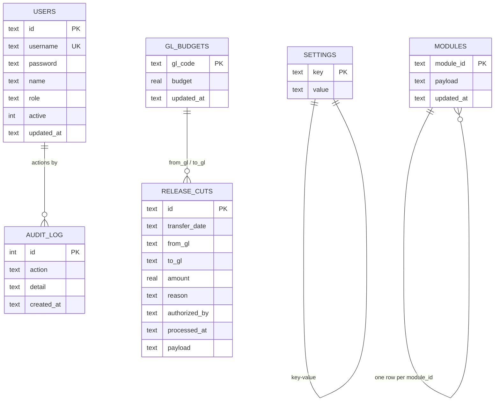
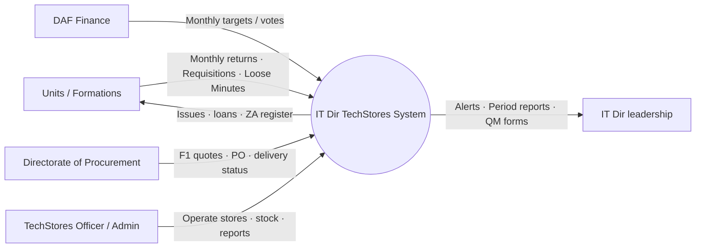
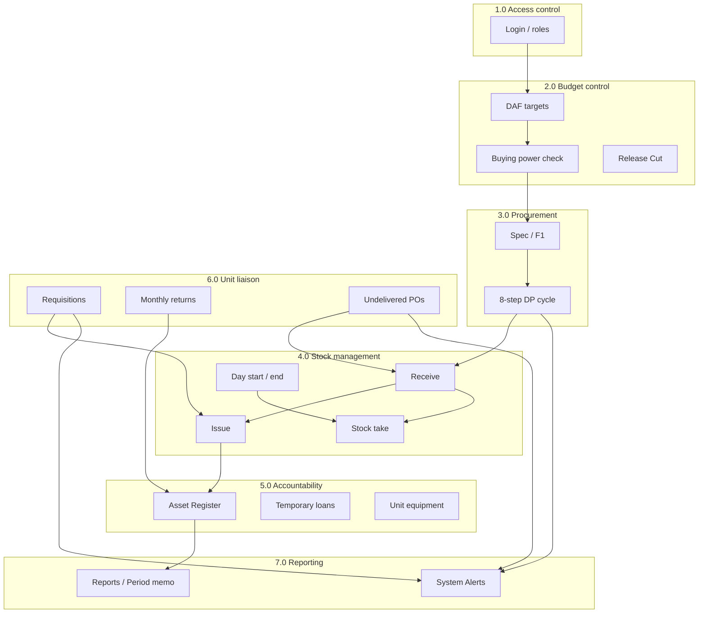
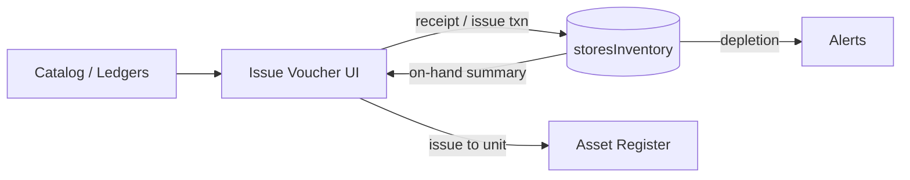
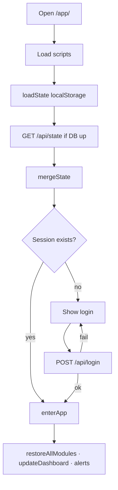
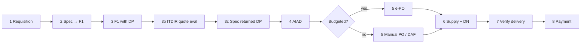
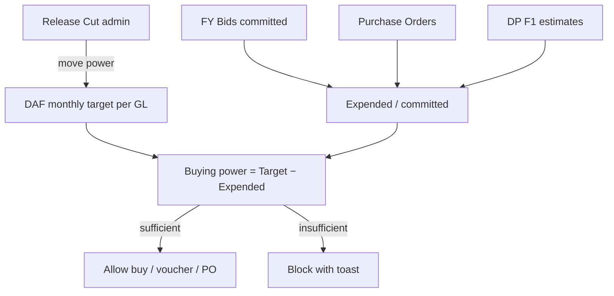
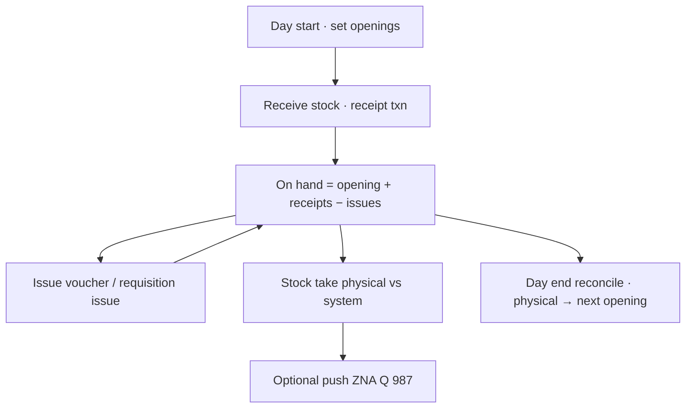
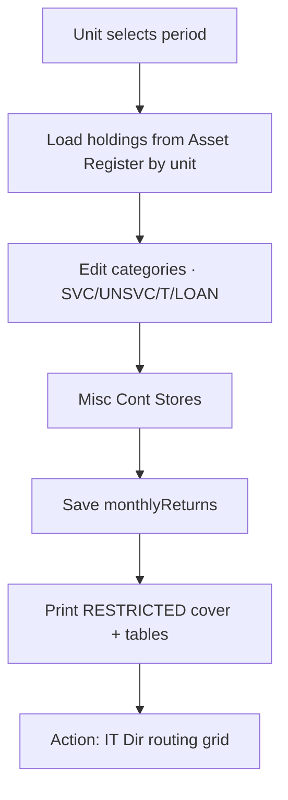

# IT Dir TechStores Information System — System Documentation

> **Document control**  
> **Classification:** RESTRICTED (internal operational documentation)  
> **System:** IT-DIR Tech Stores Information System  
> **Cost centre:** Z04P2SP212  
> **Location:** `docs/SYSTEM-DOCUMENTATION.md`  
> **Status:** Living document — edit freely in Cursor / VS Code / any Markdown editor  
> **Last updated:** 28 July 2026  
> **Companion visuals:** `docs/TechStores-System-Flow-Infographic.html` · `docs/SYSTEM-DIAGRAMS.html` · `docs/ASO-Compliance-Matrix.html`  
> **ASO compliance:** `docs/ASO-COMPLIANCE-MATRIX.md` (Accounting Standing Orders, Aug 2011)

---

## Table of contents

1. [Purpose and scope](#1-purpose-and-scope)
2. [How to run](#2-how-to-run)
3. [System overview](#3-system-overview)
4. [Architecture](#4-architecture)
5. [Technology stack](#5-technology-stack)
6. [Database (SQLite)](#6-database-sqlite)
7. [Client state model (`appState`)](#7-client-state-model-appstate)
8. [Data Flow Diagrams (DFD)](#8-data-flow-diagrams-dfd)
9. [Process flowcharts](#9-process-flowcharts)
10. [Inventory & stock model](#10-inventory--stock-model)
11. [GL targets & buying power](#11-gl-targets--buying-power)
12. [Module catalogue](#12-module-catalogue)
13. [ASO compliance (Accounting Standing Orders)](#13-aso-compliance-accounting-standing-orders)
14. [Authentication & roles](#14-authentication--roles)
15. [API reference](#15-api-reference)
16. [Frontend file map](#16-frontend-file-map)
17. [Reports & alerts](#17-reports--alerts)
18. [Official forms (ZNA QM)](#18-official-forms-zna-qm)
19. [Backup & recovery](#19-backup--recovery)
20. [Security notes](#20-security-notes)
21. [Known limitations & roadmap](#21-known-limitations--roadmap)
22. [Glossary](#22-glossary)
23. [Change log (documentation)](#23-change-log-documentation)

---

## 1. Purpose and scope

The **IT Dir TechStores Information System** is a web-based application for the Information Technology Directorate (Zimbabwe National Army context) to manage:

| Domain | Examples |
|--------|----------|
| **Budget / finance** | DAF monthly targets, buying power, Release Cut, FY bids |
| **Procurement** | Spec evaluation, DP F1, 8-step ICT procurement cycle |
| **Stock** | Receive / issue, day start–end, stock take, ledgers |
| **Accountability** | ZA Asset Register, unit equipment, temporary loans |
| **Unit liaison** | Requisitions (Loose Minutes), monthly returns, undelivered POs |
| **Reporting** | Module reports, TechStores Period Report, ZNA QM forms |

**In scope:** Local demo / operational use on a controlled workstation (`127.0.0.1`).  
**Out of scope (current build):** Multi-site concurrent users with server-side session auth, cloud hosting, mobile apps.

---

## 2. How to run

1. Ensure **Python 3** is installed.
2. Double-click `START-SYSTEM.bat` **or** run:
   ```bat
   python server.py
   ```
3. Open: **http://127.0.0.1:8080/app/**
4. Optional DB viewer: **http://127.0.0.1:8080/db-viewer**

### Default logins

| Username | Password | Role |
|----------|----------|------|
| `admin` | `admin123` | Administrator |
| `store` | `store123` | Store Officer |
| `viewer` | `view123` | Viewer (read-only) |

> Change default passwords before any wider deployment.

---

## 3. System overview

```text
┌─────────────────────────────────────────────────────────────────┐
│                     USER (Browser)                               │
│   http://127.0.0.1:8080/app/   · HTML + CSS + JS modules        │
└────────────────────────────┬────────────────────────────────────┘
                             │ HTTP (REST JSON + static files)
┌────────────────────────────▼────────────────────────────────────┐
│              server.py  (Python ThreadingHTTPServer)             │
│   Static file serving · /api/* · /db-viewer                      │
└────────────────────────────┬────────────────────────────────────┘
                             │ sqlite3
┌────────────────────────────▼────────────────────────────────────┐
│                     techstores.db (SQLite)                        │
│   users · gl_budgets · modules · release_cuts · settings · audit │
└─────────────────────────────────────────────────────────────────┘

Also: browser localStorage key techstores_gl_v1 (full appState mirror)
      sessionStorage key techstores_session_v1 (logged-in user id)
```

**Design principle:** Modular frontend under `app/` (not the legacy single-file `TECHSTORES SYSTEM 2026.html`). Business data lives in client `appState`, synced to SQLite for core entities and to localStorage for the full working set.

---

## 4. Architecture

### 4.1 Logical layers

| Layer | Responsibility | Key files |
|-------|----------------|-----------|
| **Presentation** | Screens, forms, tables, toasts | `app/index.html`, `app/css/main.css` |
| **Application logic** | Modules, validation, alerts, reports | `app/js/*.js` |
| **State** | In-memory + persistence orchestration | `state.js`, `modules-data.js` |
| **API / server** | Auth, state load/save, static host | `server.py` |
| **Data** | SQLite + localStorage | `techstores.db`, browser storage |

### 4.2 Component diagram (Mermaid)



### 4.3 Persistence strategy (important)

| Data | Where it lives |
|------|----------------|
| Users, GL FY budgets, `modules` form payloads, release cuts, theme/version | **SQLite** via `PUT/GET /api/state` |
| Inventory txns, stock takes, requisitions, undelivered, DP procurements, monthly returns, ICT register, monthly GL targets | Primarily **`appState` + localStorage** (sent on PUT but not all keys are first-class SQLite columns yet) |
| Session | **sessionStorage** |

**Practical implication:** Use Admin **Backup** (JSON export) regularly so inventory and unit data are not lost if localStorage is cleared. See [§20](#20-known-limitations--roadmap).

---

## 5. Technology stack

| Component | Choice |
|-----------|--------|
| Backend | Python 3 · `http.server.ThreadingHTTPServer` |
| Database | SQLite 3 (`techstores.db`) |
| Frontend | Vanilla HTML5 / CSS3 / JavaScript (no React/Vue build step) |
| Password hashing | PBKDF2-HMAC-SHA256 (120 000 iterations) |
| Specs lookup | `product_specs_lookup.py` + catalog JS |

---

## 6. Database (SQLite)

**File:** `techstores.db` (project root)  
**Init:** `init_db()` in `server.py`

### 6.1 Entity–relationship overview



### 6.2 Table definitions

#### `settings`

| Column | Type | Notes |
|--------|------|--------|
| `key` | TEXT PK | e.g. `theme`, `version` |
| `value` | TEXT | JSON-encoded string |

#### `users`

| Column | Type | Notes |
|--------|------|--------|
| `id` | TEXT PK | e.g. `u-admin` |
| `username` | TEXT UNIQUE | Login name |
| `password` | TEXT | `pbkdf2$iterations$salt$digest` |
| `name` | TEXT | Display name |
| `role` | TEXT | `admin` \| `store_officer` \| `viewer` |
| `active` | INTEGER | 1 = active |
| `updated_at` | TEXT | ISO UTC |

#### `gl_budgets`

| Column | Type | Notes |
|--------|------|--------|
| `gl_code` | TEXT PK | e.g. `3112210001` |
| `budget` | REAL | FY reference budget |
| `updated_at` | TEXT | |

Default seed GLs: `2200600002`, `2200600003`, `220200002`, `2201900002`, `3112210001`.

#### `modules`

| Column | Type | Notes |
|--------|------|--------|
| `module_id` | TEXT PK | Matches frontend module id |
| `payload` | TEXT | JSON: `{ fields: [...], tables: { tbodyId: [rows] } }` |
| `updated_at` | TEXT | |

#### `release_cuts`

| Column | Type | Notes |
|--------|------|--------|
| `id` | TEXT PK | |
| `transfer_date` | TEXT | |
| `from_gl` / `to_gl` | TEXT | |
| `amount` | REAL | |
| `reason` / `authorized_by` | TEXT | |
| `processed_at` | TEXT | |
| `payload` | TEXT | Full JSON record |

#### `audit_log`

| Column | Type | Notes |
|--------|------|--------|
| `id` | INTEGER PK AUTO | |
| `action` | TEXT | e.g. `login`, `state_saved`, `server_start` |
| `detail` | TEXT | |
| `created_at` | TEXT | |

### 6.3 SQL (reference)

```sql
-- See server.py init_db() for authoritative CREATE TABLE scripts.
SELECT name FROM sqlite_master WHERE type='table' ORDER BY name;
```

---

## 7. Client state model (`appState`)

Created in `state.js` → `createDefaultState()`.

| Key | Type | Purpose |
|-----|------|---------|
| `version` | number | State schema version (2) |
| `theme` | string | UI theme |
| `glBudgets` | object | FY budgets by GL code |
| `glMonthlyTargets` | object | `{ "YYYY-MM": { gl: amount, … } }` |
| `glTargetViewMonth` | string | Selected target month |
| `releaseCuts` | array | Budget transfers |
| `storesInventory` | object | Openings, transactions, day session |
| `customInventoryLedgers` | array | User-defined ledgers |
| `customCatalogItems` | array | Ad-hoc catalog items |
| `stockTakes` | array | Saved stock-take snapshots |
| `monthlyReturns` | array | Unit monthly ICT returns |
| `ictAccountability` | array | ZNA ICT Asset Register |
| `requisitions` | array | Unit Loose Minutes / requisitions |
| `undeliveredOrders` | array | PO lines awaiting delivery |
| `dpProcurements` | array | Procurement cycle cases |
| `modules` | object | Form modules: fields + table rows |
| `users` | array | Client copy of users |

### Module payload shape

```json
{
  "fields": [ { "id": "fieldId", "value": "…" } ],
  "tables": {
    "voucher-table-body": [
      { "cells": [ { "value": "…" }, … ], "staticCells": [ … ] }
    ]
  }
}
```

---

## 8. Data Flow Diagrams (DFD)

### 8.1 Context diagram (Level 0)



### 8.2 Level 1 — major processes



### 8.3 Level 2 — stock transaction data flow



---

## 9. Process flowcharts

### 9.1 Login & boot



### 9.2 ICT procurement cycle (8 steps)



**Alert mapping**

| Watch | Statuses / source |
|-------|-------------------|
| Still at IT Dir | Unit requisitions open + cycle steps 1, 2, 3b, 7 |
| Still at DP | `f1_with_dp`, `spec_returned_dp`, AIAD steps |
| POs awaiting delivery | Undelivered register: `awaiting` / `partial` |

### 9.3 Money path (buying power)



### 9.4 Stock path



### 9.5 Unit monthly return



---

## 10. Inventory & stock model

### 10.1 Parent inventory families

| Key | Label | Typical GL |
|-----|-------|------------|
| `zoff` | ZOFF / Consumables | `6122100009` |
| `softwares` | Softwares | `2200600003` |
| `spares` | Spares & Parts | `2201900002` |
| `ict` | ICT Equipment | `3112210001` |
| `maintenance` | Maintenance & Services | `220200002` |

Standalone ledgers examples: `inv-toner`, `inv-usb`, `inv-laptops`, `inv-desktops`, `inv-printers`, `inv-projectors`, …

### 10.2 `storesInventory` structure

```js
{
  openings: { [itemId]: number },
  transactions: [
    {
      id, date, type: "receipt"|"issue",
      itemId, category, item, description, qty, uom, gl,
      voucherNo, party, source, sourceRef, dpRef, poNumber,
      deliveryNoteRef, by, createdAt
    }
  ],
  daySession: { date, startedAt, startedBy, openingSnapshot, endedAt, … } | null,
  dayHistory: [ /* archived days */ ]
}
```

**On hand formula:**  
`onHand = opening + Σ receipts − Σ issues`

### 10.3 Stock Take snapshot (`stockTakes[]`)

Fields include: `id`, `date`, `conductedBy`, `location`, `lines[]` (`itemId`, `systemOnHand`, `physicalCount`, `variance`, `familyKey`, …).

---

## 11. GL targets & buying power

| Concept | Meaning |
|---------|---------|
| **Target** | DAF monthly vote for a GL (not the old word “budget” on the dashboard) |
| **Buying power** | Target − Expended for the selected month |
| **Expended** | Committed (bids + POs + DP F1) + voucher impact |
| **Release Cut** | Admin moves buying power between GLs for that month |

UI: Dashboard **GL Target Overview** · module `release-cut` · logic in `gl-targets.js`.

---

## 12. Module catalogue

| Module ID | Nav label | Purpose |
|-----------|-----------|---------|
| `dashboard` | Dashboard | KPIs, inventory cards, alerts |
| `gl-2200600002` | GL ZOFF / consumables | GL ledger UI (maps to 6122100009 display) |
| `gl-2200600003` | Software licences | GL ledger |
| `gl-220200002` | Tech maintenance | Job cards / GL |
| `gl-2201900002` | Spare parts | GL ledger |
| `gl-3112210001` | ICT equipment | GL ledger |
| `voucher-module` | Issue Voucher | Voucher + receive/issue + day controls |
| `stock-take` | Stock Take | Full physical count |
| `financial-year-bids` | Financial Year Bids | Bid schedule / packs |
| `unit-equipment` | Unit Equipment Table | Holding list by ZA/unit |
| `ict-accountability` | ZNA ICT Asset Register | Full accountability register |
| `accommodation-stores` | Accommodation Stores | Furniture / office stores |
| `temporary-loans` | Temporary Loans | Controlled loans (14-day rule) |
| `unit-requisitions` | Unit Requisitions | Loose Minute / demand capture |
| `monthly-returns` | Monthly Returns | Unit ICT monthly return |
| `spec-evaluation` | Spec Evaluation | Spec worksheet |
| `dp-f1-form` | DP F1 Form | Indent lines |
| `dp-procurement` | ICT Procurement Cycle | 8-step tracker |
| `zna-q-987` | ZNA Q 987 | Stocktaking certificate |
| `zna-q-3977` | ZNA Q 3977 | Neglect / damage |
| `zna-q-985` | ZNA Q 985 | Discrepancy report |
| `zna-q-1` | ZNA Q 1 | Write-off schedule |
| `zna-q-998` | ZNA Q 998 | Statement of loss / damage / destruction |
| `zna-q-1680` | ZNA Q 1680 | Debit voucher (recoveries) |
| `zna-svcs-*` / other `zna-q-*` | ZNA QM Forms | Official printables |
| `delivery-note` | Delivery Note | DN lines |
| `purchase-orders` | Purchase Orders | PO register |
| `undelivered-orders` | Undelivered Items | Awaiting delivery |
| `workshop-repairs` | Workshop Repairs | Repair register |
| `suppliers-contracts` | Suppliers | Supplier directory |
| `release-cut` | Release Cut | Admin GL transfers |
| `reports-module` | Reports | All reports hub |
| `user-management` | User Management | Admin only |

---

## 13. ASO compliance (Accounting Standing Orders)

**Authority:** *Accounting Standing Orders for the Zimbabwe National Army* (QS Branch, Army HQ, August 2011).

TechStores is aligned as a **directorate stores aid** for ICT / tech accounting. It does **not** replace unit QM equipment ledgers where ASO still applies in full.

| Status | Count (indicative) | Meaning |
|--------|--------------------|---------|
| Aligned | Core vouchers, stock take, loans, key ZNA Q forms, POs, workshop chain | Implements ASO intent for IT Dir scope |
| Partial | GL ledgers, reqs, DN, alerts, Ch 6/25/28 | Process present; form/frequency/detail missing |
| Gap | ZNA Q 985, Q 1 / Q 998, Q 1680 | Not yet in system |
| N/A | Rations, ammo, medical, FOL, etc. | Outside IT Dir scope |

**Full matrix:** [`docs/ASO-COMPLIANCE-MATRIX.md`](ASO-COMPLIANCE-MATRIX.md) · printable [`docs/ASO-Compliance-Matrix.html`](ASO-Compliance-Matrix.html)

### Headline mappings

| Module | ASO | Status |
|--------|-----|--------|
| Stock Take + Q 987 | Pt 1 Ch 9 | Aligned |
| Temporary Loans | Pt 2 Ch 3 | Aligned |
| Issue Voucher / Q 1033 | Pt 1 Ch 2–3 | Aligned |
| Purchase Orders | Pt 1 Ch 26 | Aligned |
| Workshop + 1045 / 1043 / 982 | Pt 1 Ch 15; Pt 2 Ch 5 | Aligned |
| Undelivered / DN discrepancies | Pt 1 Ch 7 | Partial — **Q 985 gap** |
| Write-off path | Pt 1 Ch 6 | Partial — Q 3977/1043 only |

### Operating rules (in-app)

1. Support every receipt/issue with Q 982, Q 1033, or SVCS 890/1045.  
2. Stock takes → Q 987; surplus on charge; deficit under Ch 6.  
3. Loans: return by voucher date; extend **2 weeks before** expiry; Q 1033 for internal issues.  
4. Beyond local repair → 1045 → 1043 → 982 → strike off 1033.  
5. Retain completed Q records **3 years** (Ch 25).

---

## 14. Authentication & roles

| Capability | admin | store_officer | viewer |
|------------|:-----:|:-------------:|:------:|
| Open store modules | ✓ | ✓ | ✓ |
| Edit / save data | ✓ | ✓ | ✗ |
| Release Cut | ✓ | ✗ | ✗ |
| User management | ✓ | ✗ | ✗ |
| Backup export/import | ✓ | ✗ | ✗ |
| Reports | ✓ | ✓ | ✓ |

- Login API: `POST /api/login`  
- Session: `sessionStorage` → `techstores_session_v1`  
- Edit gate: `canEditData()` / `requireEditAccess()` (toasts only when a **signed-in viewer** attempts an edit)

---

## 15. API reference

| Method | Path | Body / notes | Response |
|--------|------|--------------|----------|
| GET | `/api/health` | — | `{ ok, database, stats }` |
| GET | `/api/state` | — | `{ ok, appState, stats }` |
| PUT | `/api/state` | `{ appState }` | Save core state to SQLite |
| POST | `/api/login` | `{ username, password }` | `{ ok, user }` (no password hash) |
| POST | `/api/product-specs` | `{ query }` | Spec lookup result |
| GET | `/db-viewer` | — | HTML dump of tables |
| GET | `/app/` | — | SPA shell |

CORS: enabled for local demo. Server binds `127.0.0.1:8080`.

---

## 16. Frontend file map

| File | Role |
|------|------|
| `config.js` | Roles, GLs, MODULE_IDS, defaults |
| `state.js` | load/save/merge appState |
| `auth.js` | Login, access, users UI |
| `dashboard.js` | Navigation, KPIs, Release Cut UI hooks |
| `inventory-ledgers.js` | Parent/standalone ledgers |
| `catalog.js` | Stores catalog |
| `voucher-inventory.js` | Stock txns, day session, summaries |
| `stock-take.js` | Physical stock take |
| `ict-accountability.js` | Asset register |
| `requisitions.js` | Unit requisitions / Loose Minutes |
| `monthly-returns.js` | Monthly returns |
| `undelivered.js` | Undelivered POs |
| `dp-procurement.js` | Procurement cycle |
| `gl-targets.js` | Monthly targets / buying power |
| `alerts.js` | Dashboard watch sections |
| `reports.js` / `techstores-period-report.js` | Reporting |
| `backup.js` | JSON backup |
| `boot.js` | DOMContentLoaded wiring |

Script load order is listed at the bottom of `app/index.html` (config → … → boot).

---

## 17. Reports & alerts

### Alerts (always-on watch blocks)

1. **PENDING REQUISITIONS (STILL AT IT DIR)**  
2. **PENDING REQUISITIONS (STILL AT DP)**  
3. **PURCHASE ORDERS (AWAITING DELIVERY)**  
4. Plus loans, contracts, stock depletion, software renewals (“Other alerts”)

### Reports hub

- Per-module Generate Report  
- **TechStores Period Report** (RESTRICTED memo: deliveries, DAF, undelivered POs, pending DP, cash buys, stock, licences)  
- Export: Print / PDF / Word / CSV (where wired)

---

## 18. Official forms (ZNA QM)

| Form | Purpose |
|------|---------|
| ZNA Q 982 | Combined indent |
| ZNA Q 178 | Sub ledger |
| ZNA Q 1033 | Issue & receipt voucher |
| ZNA Q 1043 | Condemnation |
| ZNA Q 80 | Ledger sheet |
| ZNA SVCS/890 | Demand / issue |
| ZNA Q 1179 | Clothing issue |
| ZNA Q 987 | Stocktaking certificate |
| ZNA Q 3977 | Neglect / damage |
| ZNA Q 985 | Discrepancy report (consignment vs voucher) |
| ZNA Q 1 | Write-off schedule |
| ZNA Q 998 | Statement of loss / damage / destruction |
| ZNA Q 1680 | Debit voucher (recoveries to public funds) |
| ZNA SVCS 1045 | Workshop indent |
| ZNA Q 1157 | Clothing & equipment record |
| DP F1 | Official indent |
| Accommodation Stores | Inventory of accommodation stores |
| Monthly Returns | Unit ICT return (cover + SVC tables) |

---

## 19. Backup & recovery

1. Sign in as **admin**  
2. Use **Backup** export → download JSON of full `appState`  
3. Keep copies of `techstores.db`  
4. Import JSON to restore client state when needed  

Recommended cadence: after major stock takes, month-end, and before PC wipe/reimage.

---

## 20. Security notes

**Already in place**

- PBKDF2 password hashes in SQLite  
- API does not return password hashes  
- Localhost bind for demo server  

**Recommended before wider use**

1. Change all default passwords  
2. Server-side session tokens  
3. Persist inventory arrays as first-class SQLite tables  
4. Automated `techstores.db` backups  
5. Restrict network exposure (keep on `127.0.0.1` or VPN)  

---

## 21. Known limitations & roadmap

| Limitation | Impact | Suggested fix |
|------------|--------|---------------|
| Not all `appState` keys mapped to SQLite columns | Inventory/reqs may vanish if only DB restored without localStorage | Extend `save_full_state` / dedicated tables |
| Session in sessionStorage only | Easy logout on tab close; weaker auth | Token sessions |
| Single-user workstation assumption | Concurrent editors can overwrite state | Optimistic locking / per-entity APIs |
| Default demo passwords | Security risk if shared | Force password change on first login |
| ASO gaps (Ch 28 check log; annual 31 May stock-take pack) | Incomplete procedural automation | See `docs/ASO-COMPLIANCE-MATRIX.md` priority backlog |

---

## 22. Glossary

| Term | Meaning |
|------|---------|
| **ASO** | Accounting Standing Orders (ZNA QS Branch, Aug 2011) |
| **DAF** | Directorate of Army Finance — issues monthly targets |
| **DP** | Directorate of Procurement |
| **Buying power** | Remaining authority to buy against a GL target |
| **ZA** | Internal asset / engraving number (unique in Asset Register) |
| **SVC / UNSVC / T/LOAN** | Serviceable / Unserviceable / Temporary loan (monthly returns) |
| **Loose Minute** | Formal unit request minute received at IT Dir |
| **Toast** | Temporary on-screen notification banner |
| **Stock take** | Physical count vs system on-hand (ASO Pt 1 Ch 9) |
| **Release Cut** | Transfer of buying power between GLs |

---

## 23. Change log (documentation)

| Date | Change |
|------|--------|
| 2026-07-28 | Initial full system documentation created (`docs/SYSTEM-DOCUMENTATION.md`) covering architecture, SQLite, appState, DFD, flowcharts, modules, API, security |
| 2026-07-28 | Aligned system to Accounting Standing Orders; added §13 + `docs/ASO-COMPLIANCE-MATRIX.md` / `ASO-Compliance-Matrix.html`; ASO refs on Stock Take, Loans, Vouchers, POs, Workshop, Undelivered |

---

## How to edit this document

1. Open `docs/SYSTEM-DOCUMENTATION.md` in Cursor.  
2. Edit any section — Markdown is plain text.  
3. Preview with Markdown preview (Ctrl+Shift+V in VS Code/Cursor).  
4. For printable diagrams, open `docs/SYSTEM-DIAGRAMS.html` in a browser.  
5. For ASO compliance, edit `docs/ASO-COMPLIANCE-MATRIX.md` and keep the HTML matrix in sync.  
6. Keep the change log (§23) updated when you revise processes.

**Related files**

- `ARCHITECTURE.md` — short architecture note  
- `DEMO-GUIDE.md` — demo script / logins  
- `docs/TechStores-System-Flow-Infographic.html` — one-page operational poster  
- `docs/ASO-COMPLIANCE-MATRIX.md` — full ASO ↔ module matrix  
- `docs/ASO-Compliance-Matrix.html` — printable compliance matrix  
- `docs/IT-Dir-TechStores-System-Documentation.docx` — Word export (`python docs/md_to_docx.py`)  
- `docs/IT-Dir-TechStores-ASO-Compliance-Matrix.docx` — ASO matrix Word (`python docs/aso_md_to_docx.py`)  
- `docs/SYSTEM-DIAGRAMS.html` — rendered Mermaid diagrams  

---

*End of document — IT Dir TechStores Information System*
